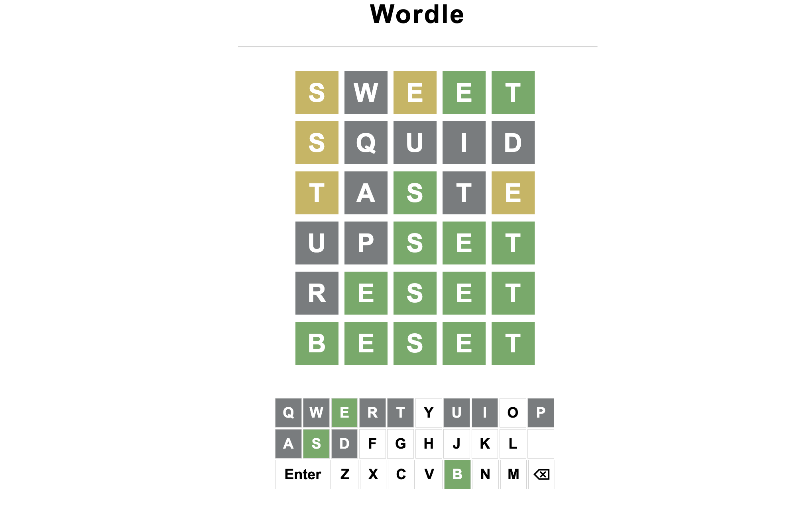

# Wordle Game

Welcome to the Wordle Game repository! This simple word-guessing game is created using HTML, CSS, and JavaScript. Test your word-guessing skills and have fun!

## Features

- **Word Guessing:** Try to guess the hidden word by entering guesses.
- **Feedback:** Receive feedback on each guess with correct letters, misplaced letters, and incorrect letters.
- **Random Words:** The game randomly selects a word from a predefined list, providing variety and challenge.

## Demo

You can play the Wordle Game by visiting the [live demo](https://wordlesum.netlify.app/)

## Getting Started

To play the Wordle Game locally, follow these steps:

1. Clone the repository:
   
   git clone https://github.com/sumeetbidhan/wordle1.git
   

2. Open the `index.html` file in your preferred web browser.

3. Start guessing the hidden word and enjoy the game!

## How to Play

1. Enter your guess in the input field.
2. Click the "Submit" button to submit your guess.
3. Receive feedback on your guess to guide your next attempt.
4. Continue guessing until you find the correct word.

## Technologies Used

- HTML
- CSS
- JavaScript

## Customization

Feel free to customize the game to suit your preferences. You can modify the word list, adjust the styling in the CSS file (`wordle.css`), or add additional features to enhance the gameplay.

## Contributing

If you have suggestions for improvements, find bugs, or want to contribute in any way, please open an issue or submit a pull request. Contributions are welcome!

